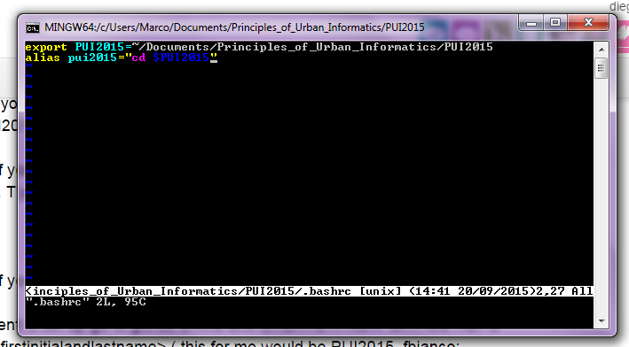
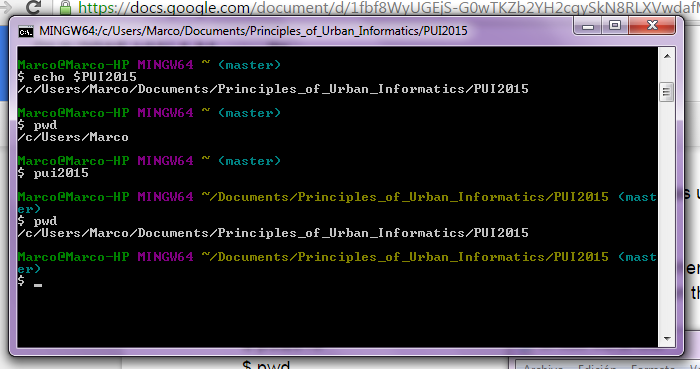

# PUI2015_dgarzon

1) For the creation of the enviromental variable and set of the alias, I used my .bashrc

    vim .bashrc

and then, I edited as one can see on the first capture:

the first line is to save an environmental variable, while de second one is to set an alias.

2) After reruning .bashrc

    source .bashrc

this commands where typed on the terminal for proving the success of the alias:

    echo $PUI2015
    pwd 
    pui2015
    pwd

and the outcomes are in the next capture:

